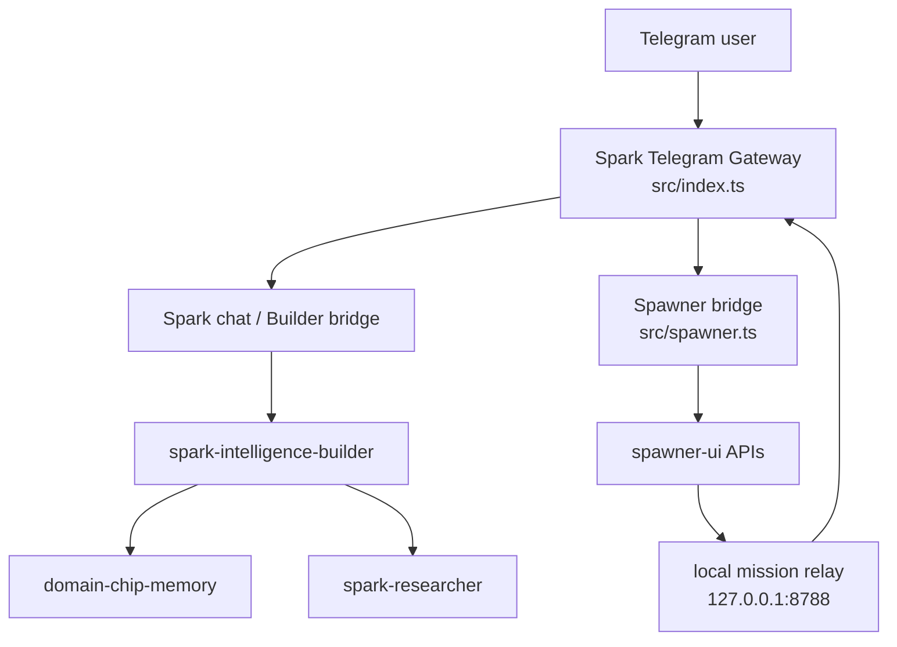
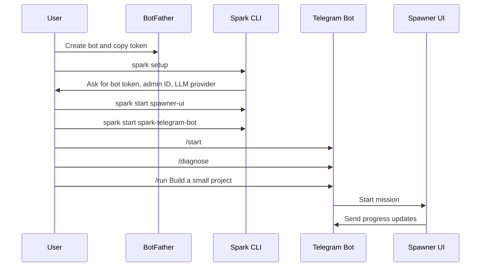

# Spark Telegram Gateway

`spark-telegram-bot` is the Telegram gateway for Spark.

It owns Telegram ingress, routes operator commands into `Spawner UI`, and relays mission lifecycle updates back into Telegram.

Current installer rule:

- this module is the current Telegram ingress owner
- this module gets the Telegram bot token
- `spark-intelligence-builder` and `spawner-ui` sit behind it
- the same Telegram bot token must not also be configured as a live ingress token in another module

Launch v1 uses Telegram long polling only. Webhook ingress is intentionally disabled until the hosted gateway path is hardened and reintroduced behind a deliberate migration.
Gateway startup acquires a durable same-host ownership lease for the bot token, with heartbeat and stale-lock recovery, so a second local gateway instance refuses to start against the same token.
Gateway state location is now configurable with `SPARK_GATEWAY_STATE_DIR`, so a hosted deployment can mount persistent state outside the repo working tree.

## What It Does

- receives Telegram updates through one long-polling gateway process
- refuses webhook mode and webhook env in this launch build
- routes normal chat to Builder memory/research when the Builder bridge is available
- keeps admin-only mission control commands in Telegram
- sends `/run` goals into `Spawner UI`
- relays mission status and terminal updates back to Telegram

## Current Architecture



Mission lifecycle events return through the local relay endpoint:

```text
Spawner UI
    |
    v
/spawner-events
    |
    v
Telegram replies
```

## Commands

General:

- `/start`
- `/myid`
- `/status`
- `/diagnose`
- `/spark`
- `/remember <text>`
- `/recall <topic>`
- `/about`

Admin-only mission control:

- `/run <goal>`
- `/runminimax <goal>`
- `/runglm <goal>`
- `/runzai <goal>`
- `/runclaude <goal>`
- `/runcodex <goal>`
- `/run2 <goal>`
- `/runall <goal>`
- `/board`
- `/updates <minimal|normal|verbose>`
- `/mission <status|pause|resume|kill> <missionId>`
- `/chip create <natural language description>`
- `/loop <chip_key> [rounds]`
- `/schedule "<cron>" mission <goal>`
- `/schedule "<cron>" loop <chipKey> [rounds]`
- `/schedules`

Natural language build requests also work for admins. For example: "build a landing page for my app" can route into the Spawner PRD/canvas path instead of returning command help.

## Gateway Mode

Launch v1 supports long polling only:

- `TELEGRAM_GATEWAY_MODE=polling`
- unset or legacy `auto` resolves to polling
- `TELEGRAM_GATEWAY_MODE=webhook` is refused
- `TELEGRAM_WEBHOOK_URL`, `TELEGRAM_WEBHOOK_SECRET`, and `TELEGRAM_WEBHOOK_PORT` are refused

Important rule:

- one Telegram token
- one active long-polling gateway owner
- no public Telegram webhook route in this launch build

## Builder Bridge

Normal chat messages can be routed into `spark-intelligence-builder` so the Telegram bot uses Builder's researcher and persistent memory path instead of the local fallback conversation memory.

Bridge env:

- `SPARK_BUILDER_BRIDGE_MODE=auto|off|required`
- `SPARK_BUILDER_REPO`
- `SPARK_BUILDER_HOME`
- `SPARK_BUILDER_PYTHON`
- `SPARK_BUILDER_TIMEOUT_MS`

Default behavior is `auto`, which looks for a sibling `spark-intelligence-builder` repo and its `.tmp-home-live-telegram-real` home. If the Builder bridge is unavailable, the bot falls back to the local `conversation + llm` path unless you set `SPARK_BUILDER_BRIDGE_MODE=required`.

Spark CLI starter installs set `SPARK_BUILDER_REPO` explicitly so the bot can find Builder from `~/.spark/modules/spark-intelligence-builder/source`.

Operator check:

```bash
npm run health:polling
```

Public Telegram webhook ingress intentionally exposes nothing in this launch build. The only local HTTP listener is the Spawner mission relay on `127.0.0.1:8788`, protected by `TELEGRAM_RELAY_SECRET`.

## Setup

In the current supported split architecture, only this repo should receive the
Telegram bot token. Builder is the Spark runtime behind the gateway. Spawner UI
is the execution plane behind the gateway.

1. Copy `.env.example` to `.env` for manual local development only.
2. Set `BOT_TOKEN` locally; do not paste it into docs, command arguments, screenshots, or issue reports.
3. Set `ADMIN_TELEGRAM_IDS`. Run `/myid` in the bot to get your numeric ID.
   The bot is private by default; non-admin users only get `/start` and `/myid`
   unless you add them to `ALLOWED_TELEGRAM_IDS` or explicitly set
   `TELEGRAM_PUBLIC_CHAT_ENABLED=1`.
4. Set `TELEGRAM_RELAY_SECRET` to a random 24+ character value. Spark CLI
   generates this for bundled installs.
5. Keep `TELEGRAM_GATEWAY_MODE=polling`.
6. Start `spawner-ui` if you want `/run`, `/mission`, and `/board` to work.
7. Start `spark-intelligence-builder` if you want the Builder bridge instead of
   the local fallback conversation path.
8. Start the bot:

```bash
npm run dev
```

Then verify local launch config:

```bash
npm run health:polling
```

## First User Flow



## Agent Operating Guide

If you are Claude Code, Codex, or another LLM agent operating this repo:

1. Keep launch mode as long polling. Do not enable webhook env for v1.
2. Only this repo should receive `BOT_TOKEN`.
3. Put only numeric owner IDs in `ADMIN_TELEGRAM_IDS`.
4. Use `npm test`, `npm run build`, and `npm run health:polling` before claiming the gateway is healthy.
5. Use `/diagnose` to verify provider/LLM wiring from Telegram.
6. Never commit `.env`, `.env.*`, tokens, chat exports, mission logs with secrets, or screenshots containing secrets.

## Related Docs

- [TELEGRAM_WEBHOOK_FUTURE.md](./TELEGRAM_WEBHOOK_FUTURE.md)

Historical webhook/tunnel architecture notes were removed from the public launch docs because they are not part of this release.

## Notes

- Memory and Spark intelligence can be offline without breaking the mission-control path.
- `Spawner UI` is the source of truth for mission state.
- Telegram is the summary and control surface, not a second workflow system.
- This repo is the current production Telegram ingress owner. If Telegram ingress later moves into a hosted gateway or `spark-intelligence-builder`, that should happen by deliberate contract-parity migration, not by running both ingress paths at once.
