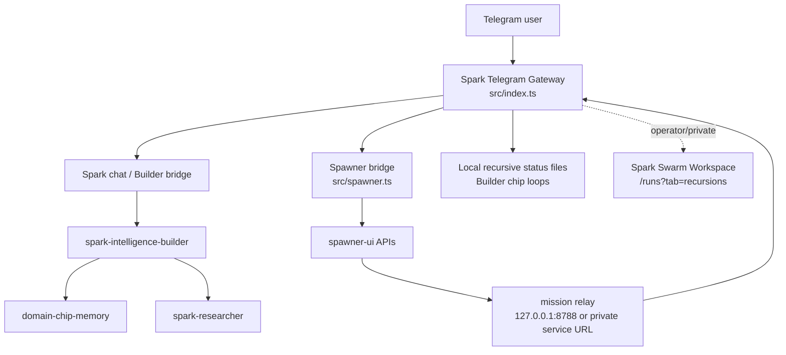
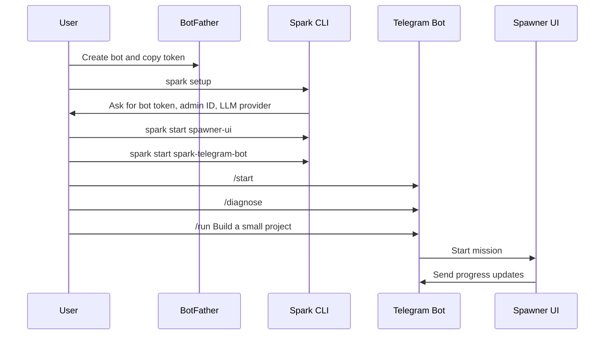

# Spark Telegram Gateway

`spark-telegram-bot` is the Telegram gateway for Spark.

It owns Telegram ingress, routes operator commands into `Spawner UI`, and relays mission lifecycle updates back into Telegram.

Current installer rule:

- this module is the current Telegram ingress owner
- this module gets the Telegram bot token
- `spark-intelligence-builder` and `spawner-ui` sit behind it
- the same Telegram bot token must not also be configured as a live ingress token in another module

Launch v1 uses Telegram long polling only. Webhook ingress is intentionally disabled until the hosted gateway path is hardened and reintroduced behind a deliberate migration.
Gateway startup acquires a durable same-host ownership lease for the bot token, with heartbeat and stale-lock recovery, so a second local gateway instance refuses to start against the same token.
Gateway state location is now configurable with `SPARK_GATEWAY_STATE_DIR`, so a hosted deployment can mount persistent state outside the repo working tree.

## What It Does

- receives Telegram updates through one long-polling gateway process
- refuses webhook mode and webhook env in this launch build
- routes normal chat to Builder memory/research when the Builder bridge is available
- builds a per-turn conversation frame so shorthand follow-ups like "change it to 4" or "the second one" can resolve against recent context
- keeps admin-only mission control commands in Telegram
- sends `/run` goals into `Spawner UI`
- runs local recursive Builder chip loops and renders concise `/recursive` reports in Telegram
- can read/sync Workspace recursion state in operator environments where Spark Swarm is installed
- sends `/recursive` reads and supported review decisions into Spark Swarm Workspace when operator sync is configured
- relays mission status and terminal updates back to Telegram

## Current Architecture


```mermaid
flowchart TD
  User["Telegram user"] --> Gateway["Spark Telegram Gateway<br/>src/index.ts"]
  Gateway --> Chat["Spark chat / Builder bridge"]
  Chat --> Builder["spark-intelligence-builder"]
  Builder --> Memory["domain-chip-memory"]
  Builder --> Researcher["spark-researcher"]
  Gateway --> SpawnerBridge["Spawner bridge<br/>src/spawner.ts"]
  SpawnerBridge --> Spawner["spawner-ui APIs"]
  Gateway --> Recursive["Local recursive status files<br/>Builder chip loops"]
  Gateway -. "operator/private" .-> Workspace["Spark Swarm Workspace<br/>/runs?tab=recursions"]
  Spawner --> Relay["mission relay<br/>127.0.0.1:8788 or private service URL"]
  Relay --> Gateway
```

Mission lifecycle events return through the relay endpoint:

```text
Spawner UI
    |
    v
/spawner-events
    |
    v
Telegram replies
```

## Commands

General:

- `/start`
- `/myid`
- `/status`
- `/diagnose`
- `/context`
- `/spark`
- `/remember <text>`
- `/recall <topic>`
- `/about`

Admin-only mission control:

- `/run <goal>`
- `/runminimax <goal>`
- `/runglm <goal>`
- `/runzai <goal>`
- `/runclaude <goal>`
- `/runcodex <goal>`
- `/run2 <goal>`
- `/runall <goal>`
- `/board`
- `/updates <minimal|normal|verbose>`
- `/mission <status|pause|resume|kill> <missionId>`
- `/chip create <natural language description>`
- `/loop <chip_key> [rounds]`
- `/recursive sessions|paths|session|report|trace|review|approve|defer|reject|more-eval|start`
- `/schedule "<cron>" mission <goal>`
- `/schedule "<cron>" loop <chipKey> [rounds]`
- `/schedules`

`/recursive start <chipKey> rounds <n>` has a public local path for Builder chip loops. It can run without Spark Swarm by using local status files and the Builder runtime installed by the Spark starter stack.

`/recursive approve|defer|reject|more-eval` mutates Spark Swarm Workspace only in operator environments where Workspace sync is configured and only for supported inbox items. Insight absorb items support approve; mastery review items support approve, defer, reject, and more-eval. Upgrade delivery, contradiction resolution, and evolution-mode changes still route operators to Workspace Decisions.

Natural language build requests also work for admins. For example: "build a landing page for my app" can route into the Spawner PRD/canvas path instead of returning command help.

## Gateway Mode

Launch v1 supports long polling only:

- `TELEGRAM_GATEWAY_MODE=polling`
- unset or legacy `auto` resolves to polling
- `TELEGRAM_GATEWAY_MODE=webhook` is refused
- `TELEGRAM_WEBHOOK_URL`, `TELEGRAM_WEBHOOK_SECRET`, and `TELEGRAM_WEBHOOK_PORT` are refused

Important rule:

- one Telegram token
- one active long-polling gateway owner
- no public Telegram webhook route in this launch build

## Builder Bridge

Normal chat messages can be routed into `spark-intelligence-builder` so the Telegram bot uses Builder's researcher and persistent memory path instead of the local fallback conversation memory.

Before the normal routing cascade, the gateway also builds a local conversation frame from recent user and assistant turns. This mirrors Builder's canonical conversation harness shape: hot verbatim turns, exact artifacts such as numbered lists or access levels, a focus stack, a reference resolution, and token-budget metadata. The frame is used for low-latency local routing and is also passed into fallback LLM context.

The frame state is persisted per user. It rolls older turns into a warm summary, keeps exact artifacts separately, and exposes `/context` for operator diagnostics. After deterministic access/status/help handling, the gateway also asks Builder for a cold-memory capsule with `memory inspect-capsule --no-record-activity`. Conversation-safe retrieved memory is appended to the frame context before admin routes, build routes, Builder bridge fallback, or local LLM fallback use it.

Canonical harness docs live in Builder:

- [Conversation context harness](../spark-intelligence-builder/docs/CONVERSATION_CONTEXT_HARNESS_2026-04-29.md)

Bridge env:

- `SPARK_BUILDER_BRIDGE_MODE=auto|off|required`
- `SPARK_BUILDER_REPO`
- `SPARK_BUILDER_HOME`
- `SPARK_BUILDER_PYTHON`
- `SPARK_BUILDER_TIMEOUT_MS`
- `SPARK_CONTEXT_BRIDGE_TIMEOUT_MS`

Default behavior is `auto`, which looks for the active installed Builder source first, then checkout fallbacks, plus the standard Spark home at `~/.spark/state/spark-intelligence`. If the Builder bridge is unavailable, the bot falls back to the local `conversation + llm` path unless you set `SPARK_BUILDER_BRIDGE_MODE=required`.

Spark CLI starter installs set `SPARK_BUILDER_REPO` explicitly so the bot can find Builder from `~/.spark/modules/spark-intelligence-builder/source`.

### Agent Environment Files

Spark agents can load their own local env files from `~/.spark/config/agents/`.
Use this for optional user-owned API keys that should belong to a Spark agent,
not to a premium domain chip.

Load order for Telegram:

- `~/.spark/config/agents/spark-common.env`
- `~/.spark/config/agents/spark-telegram-bot.env`
- `~/.spark/config/agents/spark-telegram-bot.<profile>.env`

For basic X post reads, set:

```bash
SPARK_X_BEARER_TOKEN=...
```

That enables simple Spark-owned X reads from the Telegram agent. It is separate
from `domain-chip-xcontent` / XContent, which remains the premium content
strategy, scoring, variant, and optimization lane.

### Agent Style Preference Sync

The Telegram gateway recognizes explicit, durable agent-style requests such as "when you talk to me, use short paragraphs" or "I want my agent to be more conversational". These are not treated as ordinary memory facts.

The safe flow is:

1. Telegram stores the preference in per-user local conversation notes so the next reply can adapt immediately.
2. Telegram sends a canonical style-authoring turn to Builder.
3. Builder persists the rule in the paired agent's `agent_persona_profiles` / `agent_persona_mutations` path.
4. If Builder is unavailable, Telegram keeps the local hot preference and logs the sync miss instead of claiming a durable Builder save failed or succeeded.

Users can ask what interaction preferences Spark is using for them. The gateway answers from the same per-user local preference notes.

This path deliberately does not write to `domain-chip-memory`, does not mutate global `spark-character`, and does not change human trait-memory overlays. Set `SPARK_AGENT_PERSONA_BUILDER_SYNC=0` to disable the Builder sync while leaving local hot preferences intact.

Operator check (run from this package directory; installed modules use `~/.spark/modules/spark-telegram-bot/source`):

```bash
# From ~/.spark/modules/spark-telegram-bot/source in an installed Spark module.
npm run health:polling
```

Public Telegram webhook ingress intentionally exposes nothing in this launch build. Local installs keep the Spawner mission relay on `127.0.0.1:8788`, protected by `TELEGRAM_RELAY_SECRET`. Hosted two-service installs can set `TELEGRAM_RELAY_HOST=::` and `TELEGRAM_RELAY_URL` to the private relay callback URL whitelisted by spawner-ui.

Telegram relays should always have an explicit profile name. A fresh install uses the neutral `primary` profile for the main bot. Secondary bots should use named profiles, their own relay ports, and their own `telegram.profiles.<name>.bot_token` secret. The legacy unnamed/default path is only a compatibility alias.

## Agent Knowledge Base

Normal chat is guided by small Markdown knowledge files in `agent-knowledge/`.
These files describe Spark access, memory, and day-to-day usage so the selected
chat model can answer naturally from shared Spark context instead of triggering
deterministic utility replies.

Current files:

- `agent-knowledge/access.md`
- `agent-knowledge/memory.md`
- `agent-knowledge/self-awareness.md`
- `agent-knowledge/spark-doc-sources.md`
- `agent-knowledge/spark-system.md`
- `agent-knowledge/using-spark.md`

Set `SPARK_AGENT_KNOWLEDGE_DIR` to point at another directory if a deployment
needs a custom knowledge pack. Set `SPARK_AGENT_KNOWLEDGE_ENABLED=0` to disable
this prompt injection for tests or constrained environments.

Rule of thumb: add reusable Spark knowledge here, but keep actual commands
explicit. Utility panels should stay behind slash commands like `/access`,
`/workspaces`, `/board`, and `/diagnose`.

## Setup

In the current supported split architecture, only this repo should receive the
Telegram bot token. Builder is the Spark runtime behind the gateway. Spawner UI
is the execution plane behind the gateway.

1. Copy `.env.example` to `.env` for manual local development only.
2. Set `BOT_TOKEN` locally; do not paste it into docs, command arguments, screenshots, or issue reports.
3. Set `ADMIN_TELEGRAM_IDS`. Run `/myid` in the bot to get your numeric ID.
   The bot is private by default; non-admin users only get `/start` and `/myid`
   unless you add them to `ALLOWED_TELEGRAM_IDS` or explicitly set
   `TELEGRAM_PUBLIC_CHAT_ENABLED=1`.
4. Set `TELEGRAM_RELAY_SECRET` to a random 24+ character value. Spark CLI
   generates this for bundled installs.
5. Keep `TELEGRAM_GATEWAY_MODE=polling`.
6. Start `spawner-ui` if you want `/run`, `/mission`, and `/board` to work. For hosted two-service deploys, set `SPAWNER_UI_URL` to the private spawner-ui service URL, set this bot's `TELEGRAM_RELAY_URL` to its private `/spawner-events` URL, and put the same callback URL in spawner-ui `MISSION_CONTROL_WEBHOOK_URLS`. `SPARK_SPAWNER_URL` is accepted as a legacy alias for `SPAWNER_UI_URL`.
7. Optional: put user-owned agent API keys in `~/.spark/config/agents/`, for example `SPARK_X_BEARER_TOKEN` in `spark-telegram-bot.env` for basic X reads.
8. Start `spark-intelligence-builder` if you want the Builder bridge instead of
   the local fallback conversation path.
9. Start the bot:

```bash
npm run dev
```

Then verify local launch config from the same package directory:

```bash
# From ~/.spark/modules/spark-telegram-bot/source in an installed Spark module.
npm run health:polling
```

## Deploy To The Live Mirror

For local Spark installs, deploy the Telegram gateway with one guarded command
from the source checkout:

```bash
npm run restart:safe
```

The command rebuilds `dist/`, syncs the declared runtime files into the live
mirror, runs the strict runtime drift check, and only then restarts the
`spark-recursive` Telegram profile through `spark.cmd`. If the check prints
`DRIFT`, do not restart from stale output. Read the listed paths, rerun
`npm run build:sync`, and repeat `npm run sync:check:strict` until it prints
`[check] runtime in sync.`

## Railway / Docker

This repo includes a Dockerfile for the hosted Telegram gateway service. The
container starts with `npm start` and listens for private mission relay traffic
on `TELEGRAM_RELAY_PORT` when the relay is enabled.

For a two-service Railway deploy, keep the bot and Spawner UI in the same
project environment and use Railway private DNS between them:

- `TELEGRAM_GATEWAY_MODE=polling`
- `TELEGRAM_RELAY_HOST=::`
- `TELEGRAM_RELAY_PORT=8788`
- `TELEGRAM_RELAY_URL=http://spark-telegram-bot.railway.internal:8788/spawner-events`
- `SPAWNER_UI_URL=http://spawner-ui.railway.internal:<spawner-port>`
- `SPAWNER_UI_PUBLIC_URL=https://<protected-spawner-public-domain>`
- `SPARK_BRIDGE_API_KEY=<same long value as spawner-ui>`
- `SPARK_GATEWAY_STATE_DIR=/data/spark-gateway`

This service is the only Telegram long-polling owner in the split shape. Do not
also set `TELEGRAM_BOT_TOKEN` on a Spark Live monolith or VPS supervisor that can
start `spark-telegram-bot`; otherwise Telegram will return `409 Conflict` and
one poller will be terminated.

`SPAWNER_UI_URL` is for private service-to-service calls only. If it uses
`railway.internal`, also set `SPAWNER_UI_PUBLIC_URL` so Telegram mission links
open the protected public Spawner UI instead of Railway's private DNS.
`SPARK_SPAWNER_URL` is accepted as a legacy compatibility alias, but new setup
should use `SPAWNER_UI_URL`.

Mount a persistent volume at `/data` for gateway state. Keep `BOT_TOKEN`,
`ADMIN_TELEGRAM_IDS`, `TELEGRAM_RELAY_SECRET`, and provider keys in Railway
service variables, not in the image or repo.

Before the first deploy, run `npm run deploy:doctor -- --role bot` in the
hosted environment. It catches loopback relay hosts, missing public Spawner
links, short shared secrets, missing `/data` state paths, and the
`SPARK_MISSION_LLM_PROVIDER=anthropic` provider-name mistake.

## First User Flow


```mermaid
sequenceDiagram
  participant U as User
  participant B as BotFather
  participant S as Spark CLI
  participant T as Telegram Bot
  participant P as Spawner UI

  U->>B: Create bot and copy token
  U->>S: spark setup
  S->>U: Ask for bot token, admin ID, LLM provider
  U->>S: spark start spawner-ui
  U->>S: spark start spark-telegram-bot
  U->>T: /start
  U->>T: /diagnose
  U->>T: /run Build a small project
  T->>P: Start mission
  P->>T: Send progress updates
```

## Agent Operating Guide

If you are Claude Code, Codex, or another LLM agent operating this repo:

1. Keep launch mode as long polling. Do not enable webhook env for v1.
2. Only this repo should receive `BOT_TOKEN`.
3. Put only numeric owner IDs in `ADMIN_TELEGRAM_IDS`.
4. Use `npm test`, `npm run build`, and `npm run health:polling` before claiming the gateway is healthy.
5. `npm test` is offline-safe and injects a dummy token when `BOT_TOKEN` is unset. Use `npm run test:live-token` only when a real tester bot token is intentionally configured.
6. Use `/diagnose` to verify provider/LLM wiring from Telegram.
7. Never commit `.env`, `.env.*`, tokens, chat exports, mission logs with secrets, or screenshots containing secrets.
8. Keep relay identity named. The main bot should report its configured primary profile, usually `primary`; tester bots should report their own profile names.

## Related Docs

- [TELEGRAM_WEBHOOK_FUTURE.md](./TELEGRAM_WEBHOOK_FUTURE.md)

Historical webhook/tunnel architecture notes were removed from the public launch docs because they are not part of this release.

## License

MIT. See [LICENSE](./LICENSE).

Spark Swarm is AGPL-licensed. Other Spark repos are MIT unless their
LICENSE file says otherwise. Spark Pro hosted services, private corpuses,
brand assets, deployment secrets, and Pro drops are not included in
open-source licenses. Pro drops do not grant redistribution rights unless
a separate written license says so.

## Notes

- Memory and Spark intelligence can be offline without breaking the mission-control path.
- `Spawner UI` is the source of truth for mission state.
- Telegram is the summary and control surface, not a second workflow system.
- This repo is the current production Telegram ingress owner. If Telegram ingress later moves into a hosted gateway or `spark-intelligence-builder`, that should happen by deliberate contract-parity migration, not by running both ingress paths at once.
