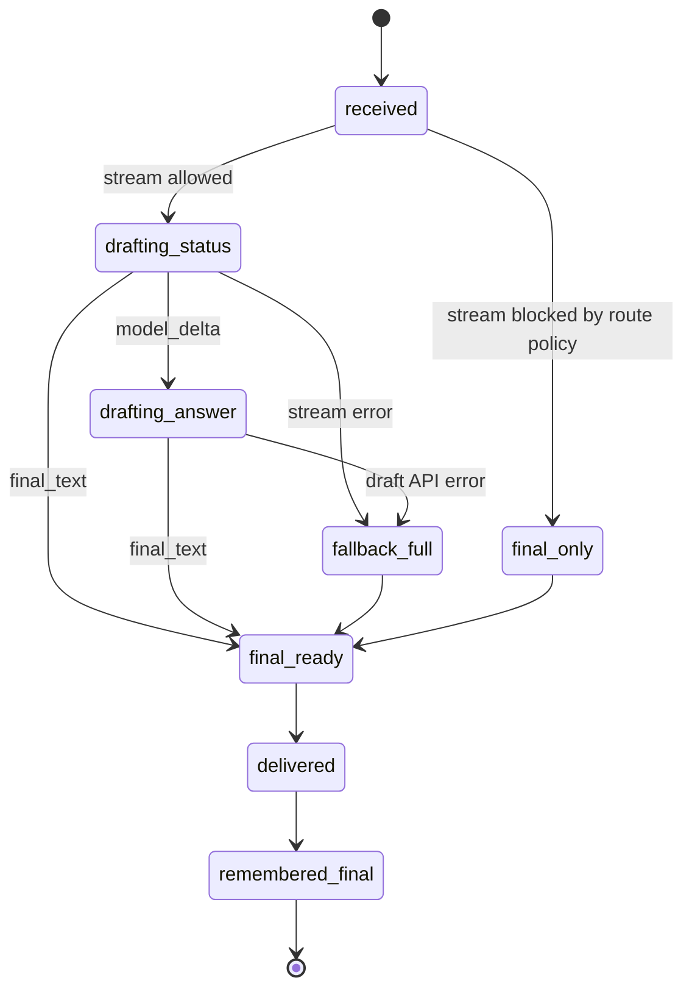
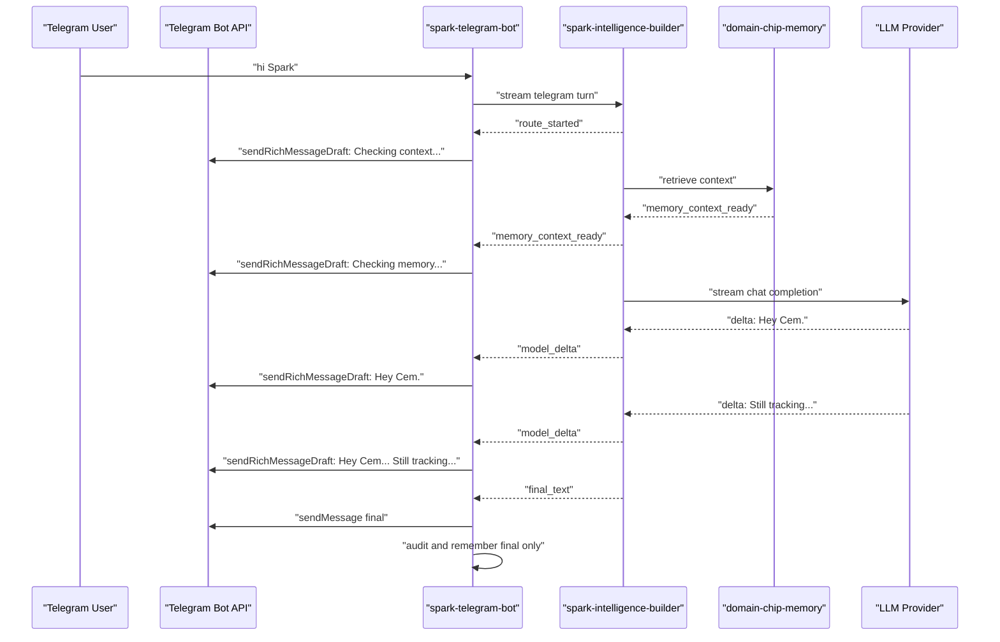

# Live Chat Streaming Design

## Goal

Make talking with Spark in Telegram feel alive, close to the Codex chat experience:

- immediate acknowledgement that Spark is thinking
- visible progress while Builder gathers context, memory, tools, or model output
- real token streaming whenever the model/provider can stream
- no fake memory writes, no draft residue, no mission workflow changes
- final messages remain authoritative, sanitized, audited, and stored through the existing paths

The guiding rule: Telegram drafts are presentation only. Spark truth lives in Builder events, final replies, memory movement traces, and mission relay events.

## Current State

Telegram Bot API 10.1 adds Rich Messages for bots, including `sendRichMessageDraft`, which can stream a partial rich message to a target private chat while a bot is generating. The Bot API requires a non-zero `draft_id`; changes using the same `draft_id` animate as an ephemeral preview, and the final answer should still be delivered through the normal final-message path.

Spark now uses Rich Messages by default for final text delivery and `sendRichMessageDraft` by default for draft previews. Legacy `sendMessage` and `sendMessageDraft` remain automatic fallbacks for older Telegram surfaces or transient API incompatibility.

Sources:

- https://core.telegram.org/bots/api#sendrichmessagedraft
- https://core.telegram.org/bots/api#inputrichmessage
- https://telegram.org/blog/ai-bot-revolution-11-new-features

## Telegram Features Worth Using

Bot API 10.1 Rich Messages are the main upgrade path for Spark:

- `sendRichMessageDraft` for visible in-progress replies.
- `sendRichMessage` for persistent rich final replies while preserving final-message audit and memory boundaries.
- `InputRichMessage.markdown` or `InputRichMessage.html` for cleaner headings, lists, block quotes, tables, and compact evidence sections.
- `<tg-thinking>` / `RichBlockThinking` for a first-class "thinking" surface when Telegram clients support it. Spark should use this only for short user-visible status, not hidden reasoning.

Other recent Telegram surfaces to consider after streaming is proven:

- guest mode and `answerGuestQuery` for public or invite-less Spark entry points.
- reaction improvements for lightweight feedback on answers, review queues, and mission relays.
- managed bots and bot-to-bot communication for future Spark agent profiles, only after identity and access boundaries are explicit.
- richer poll/media support for review queues, pickers, and lightweight approvals.

Spark currently has two answer paths:

1. Local fallback LLM path
   - `src/llm.ts` can stream OpenAI-compatible and Ollama responses.
   - `src/index.ts` can pass streamed partial text to Telegram drafts.
   - This is real streaming.

2. Builder bridge path
   - `runBuilderTelegramBridge(...)` returns one completed `responseText`.
   - Telegram has no real chunks to stream.
   - The current draft-preview experiment can animate completed text, but it is not true streaming and may add a small delay.

## UX Principles

### What Should Feel Alive

Normal private chat should feel like:

1. User sends a message.
2. Spark quickly shows a meaningful draft state.
3. If memory/tools are involved, the draft names the current stage in plain language.
4. Once model generation starts, the draft becomes the answer and grows naturally.
5. Final message arrives once, cleanly.

Example:

```text
Checking recent context...

Checking memory for the active focus...

Hey Cem.

Still tracking the persistent memory quality evaluation as your active focus...

[final message]
Hey Cem.

Still tracking the persistent memory quality evaluation as your active focus. Want to pick that back up, or are we shifting gears?
```

### What Must Not Stream

Do not draft-stream routes where partial text could mislead the user:

- mission creation acknowledgements
- `/run`, `/build`, `/mission`, `/board`, `/diagnose`, `/probe`
- permission or access denials
- destructive or operational confirmations
- image/file analysis until the image pipeline has typed stream events
- memory-save confirmations unless the save result is already known

For those, use existing mission relay updates or final messages.

### Draft Copy Style

Draft status should be short and situational:

- "Checking recent context..."
- "Checking memory..."
- "Looking at the active mission state..."
- "Preparing the answer..."

Avoid:

- fake specificity
- internal implementation dumps
- progress bars
- "I saved this" before the save is confirmed
- markdown-heavy drafts

### Latency Targets

Use latency budgets so the feature can be judged by feel, not just by correctness.

| Moment | Target | Hard Limit | Notes |
| --- | --- | --- | --- |
| first visible feedback | under 500ms | 1000ms | draft status or typing action |
| memory/tool status | under 1500ms | 3000ms | only when route uses memory/tools |
| first answer token | under 2500ms | 5000ms | for stream-capable providers |
| final answer | no worse than current p95 + 300ms | current timeout | streaming must not make final delivery meaningfully slower |
| draft update cadence | 300-700ms | 1200ms | faster is noisy, slower feels fake |

If the system cannot meet the first-visible-feedback target for a route, that route should stay final-only until the upstream can emit an early event.

### Turn State Machine

Each Telegram turn should have one explicit streaming state.



State ownership:

- Telegram drafts are owned by `drafting_status` and `drafting_answer`.
- Memory persistence starts only after `delivered`.
- Mission relay ownership never enters this state machine; it uses its existing event flow.

## Target Architecture



## Builder Event Protocol

Builder should expose a streaming command in addition to the existing full-response command.

Proposed command:

```bash
python -m spark_intelligence.cli gateway stream-telegram-update update.json --home <home> --origin telegram-runtime --jsonl
```

Output format: newline-delimited JSON, one event per line.

### Event Envelope

```json
{
  "version": "spark.telegram.stream.v1",
  "event_id": "evt_...",
  "turn_id": "telegram:<chat_id>:<message_id>",
  "seq": 1,
  "type": "route_started",
  "ts": "2026-05-07T19:00:00.000Z",
  "draft": {
    "kind": "status",
    "text": "Checking recent context..."
  },
  "memory_policy": {
    "draft_is_persistent": false
  }
}
```

### Minimal Final Event

Builder should always be able to emit this even if all streaming substeps are disabled:

```json
{
  "version": "spark.telegram.stream.v1",
  "turn_id": "telegram:8319079055:1234",
  "seq": 4,
  "type": "final_text",
  "text": "Hey Cem.\n\nStill tracking the persistent memory quality evaluation as your active focus.",
  "routing": {
    "decision": "memory_chat",
    "bridge_mode": "runtime_command"
  },
  "persistence": {
    "remember_assistant_reply": true
  }
}
```

This keeps the streaming protocol useful before model-token streaming exists.

### Event Types

`route_started`

- Emitted immediately after Builder accepts the turn.
- Draft text can be generic and safe.

`context_ready`

- Local conversation frame or hot-turn context is ready.
- No memory claims yet.

`memory_lookup_started`

- Builder is checking memory.
- Draft text: "Checking memory..."

`memory_context_ready`

- Memory context has been selected.
- Include counts and source classes for telemetry, not user-facing details by default.

`tool_started`

- Tool or route begins, such as wiki answer, self-awareness, route probe.
- Only draft-stream safe tools.

`tool_result`

- Tool completed.
- Include structured status and evidence boundaries.

`model_started`

- Model request started.
- Draft text can transition to "Preparing the answer..."

`model_delta`

- Text token/chunk from provider.
- Only this should accumulate into the answer body.

`final_text`

- Final user-facing message.
- This is the only text that Telegram sends as a final message and remembers as assistant reply.

`final_metadata`

- Routing decision, memory movement, provider, latency, and source counts.
- For logs/evals, not user-facing by default.

`error`

- Typed failure with recovery message.
- Bot clears/finalizes with a safe final error reply.

## Telegram Bot Consumer

Add `runBuilderTelegramBridgeStream(...)` beside `runBuilderTelegramBridge(...)`.

Responsibilities:

- spawn Builder stream command
- parse JSONL incrementally
- validate event schema and sequence
- maintain one active draft per Telegram turn
- throttle draft updates
- send final message once
- persist/audit final message only
- fall back to existing full-response bridge on stream startup failure

Draft throttling:

- default 300-700ms
- send on sentence/paragraph boundary if possible
- force send when a status stage changes
- cap draft text to Telegram's message draft limit
- stop using drafts after the first draft API failure for that turn

### Backpressure And Cancellation

Telegram draft updates must never back up the Builder stream.

Rules:

- Keep only the latest pending draft text.
- If a draft API call is in flight, coalesce newer text into the next update.
- If Telegram returns rate-limit metadata, respect it and continue collecting final text.
- If the user sends a new message while a stream is active, do not cancel v1 automatically. Finish the current turn, then process the next one.
- Future cancellation can be added with a per-chat `turn_id` cancel map, but only after final-message and memory boundaries are proven.

### Client Compatibility

`sendRichMessageDraft` is private-chat scoped in the Bot API. The consumer should treat private chat as the supported target.

Policy:

- private chat: enable drafts when configured
- group/supergroup: final-only unless Telegram documents and live tests draft behavior there
- channel/direct messages chat: final-only until separately tested
- unsupported clients: draft calls may succeed but not visibly animate; final message remains the UX fallback

## Provider Streaming

For real answer streaming, Builder must call providers in streaming mode where available:

- OpenAI-compatible chat completions: SSE chunks
- Ollama: newline-delimited JSON chunks
- Anthropic API: event stream
- CLI providers such as Codex/Claude Code: initially full response unless their CLI exposes machine-readable stream events

Provider adapters should normalize all provider chunks into Builder `model_delta` events.

## Route Policy

| Route | Streaming Policy | Notes |
| --- | --- | --- |
| plain chat | full streaming | ideal first target |
| memory recall | status + streamed final answer | no memory claims until retrieved |
| memory save | final only | avoid saying saved before confirmation |
| wiki answer | status + streamed final answer | include source boundary in final |
| self-awareness | status + final, then stream later | structured output may be easier full-response first |
| access/config commands | final only | operator control should be crisp |
| mission/build/run | no draft streaming | use mission relay events |
| mission relay | existing updates | already event-driven |
| diagnostics/probe | final only at first | can stream later with typed diagnostic events |
| images/files | status + final later | only after image route has typed events |

## Memory And Audit Rules

Drafts must not enter:

- conversation memory
- assistant reply memory
- Builder memory packets
- outbound delivered-text audit as final messages
- mission lessons

Only final messages can be:

- remembered as assistant replies
- audited as delivered content
- used for future context
- promoted into lessons or memory candidates

Builder event telemetry can be stored separately as operational trace:

```json
{
  "turn_id": "...",
  "draft_events": 8,
  "first_draft_ms": 220,
  "first_model_delta_ms": 1800,
  "final_ms": 3600,
  "draft_api_failures": 0,
  "route": "memory_chat"
}
```

### Privacy Rules

Draft text should be treated as user-visible but non-authoritative.

Do not include in draft text:

- raw memory snippets
- secret values or redacted secret placeholders
- file paths unless the final answer would safely include them
- raw tool output
- hidden chain-of-thought, reasoning traces, or provider diagnostics
- claims like "saved", "created", "deleted", "sent", or "started" before the confirmed final event

Status drafts should describe activity, not expose evidence.

## Observability

Track:

- first draft latency
- first model token latency
- final reply latency
- draft update count
- draft API failure count
- Builder event parse failures
- fallback-to-full-response count
- route distribution
- memory/context source counts
- final-text equality between stream accumulation and final output
- routes blocked from streaming by policy

Operator command:

```text
/streaming
/streaming on
/streaming off
/streaming rich on
/streaming rich_messages off
/streaming preview off
/streaming interval 500
```

Should show:

```text
Telegram live chat
Status: on
Rich messages: on
Draft transport: rich
Real streaming: Builder stream off/on
Fallback streaming: on
Full-reply preview: on
Draft interval: 500ms
Last turn: first draft 240ms, first token 1.8s, final 3.4s
Failures: 0 draft, 0 stream parse
```

### Evaluation Harness

Add a small replay harness that can run without Telegram:

```bash
npm run streaming:replay -- fixtures/streaming/plain-chat.jsonl
```

It should assert:

- first draft text and timing
- draft update count
- final text
- memory persistence eligibility
- no route-policy violations
- fallback behavior after injected JSONL or draft API failures

This gives us repeatable UX checks before live Telegram testing.

## Rollout Plan

### Phase 0: Stabilize Current Defaults

Decision: enable Rich Messages, Rich Message drafts, and full-reply previews by default, with quiet fallback to legacy Telegram methods when the client/API rejects the rich path. Full-reply preview is a bridge until Builder emits real JSONL stream events; it should be short, throttled, and private-chat scoped.

Config:

```env
SPARK_TELEGRAM_CHAT_STREAMING=1
SPARK_TELEGRAM_RICH_MESSAGES=1
SPARK_TELEGRAM_DRAFT_METHOD=rich
SPARK_TELEGRAM_DRAFT_PREVIEW_FULL_REPLIES=1
SPARK_TELEGRAM_DRAFT_INTERVAL_MS=500
```

Keep:

- real fallback LLM streaming
- admin `/streaming` controls
- direct Telegram draft smoke test

Remove from default:

- route-unsafe draft preview for mission/build/access/control flows

Exit criteria:

- `/streaming` reports the active Telegram profile, streaming, rich messages, rich draft transport, and full-reply preview on
- `/streaming` also reports process telemetry for observed final and draft transports, so "configured on" is not mistaken for "rich path succeeded"
- When no rich/draft transport has happened since process start, `/streaming` must say transport proof is only configured. Once a final or draft delivery is observed, it may say transport proof was observed in this bot process.
- fallback LLM streaming still works
- Builder chat final latency is not worse than the old path
- direct `sendRichMessage` and `sendRichMessageDraft` smoke pass for the active profile, or clearly fall back to `sendMessage` / `sendMessageDraft`

Current SparkRecursive_bot proof:

- Contract id `streaming-status-defaults`: `cp-streaming-001` confirms `/streaming` reports streaming on, rich messages on, rich draft transport, full-reply preview on, process telemetry, no duplicate draft/preview in the live Telegram surface, and one final status message after the preview collapses.
- Contract id `rich-message-delivery-proof`: `cp-streaming-002` confirms rich formatting renders in the top-level Telegram path without leaving a duplicate draft/final artifact, and its proof join must say the rich-message reply was delivered through the live Telegram profile path. A generic "reply joined" note is not enough proof that rich messages are active in runtime. The screenshot/user confirmation should also state that the rich reply collapsed to one final Telegram message.
- `cp-streaming-002` reply text should stay natural while carrying a short code-token line; the screenshot and user confirmation prove the visual rich rendering rather than forcing the chat reply into a diagnostic status card. `Status: clean` is rejected here because it turns a rich-message check into a status packet. The measured accepted shape is `Check: clean` plus `Token: ok`, delivered through the restarted live profile with one final Telegram message.
- These canaries prove the present Telegram surface and defaults. They do not claim Builder-native JSONL event streaming; that remains Phase 1.

Durability update, 2026-06-25:

- The main Telegram runtime now loads the active Spark Telegram profile env before `.env.override`, with explicit process env values preserved. This closes the gap where `/streaming` could save profile defaults but a restarted bot process could still run from repo `.env` alone.
- Profile env files are the durable source for the default-on settings above; `.env.override` remains the operator escape hatch.
- Regression coverage now proves the main runtime loads profile env before override env, loads streaming/rich defaults from profile config, and does not overwrite an explicitly supplied runtime `BOT_TOKEN` or admin env.
- The refreshed SparkRecursive_bot release packet at `outputs/live-canary-full/live-canary-observations.json` keeps release readiness separate from publish readiness; use `outputs/live-canary-full/live-canary-summary.md` for the current runtime-evidence timestamp.
- The packet now rejects stale source snapshots and prints registry-pin drift as an explicit release caveat and handoff, so a docs/source edit must be committed and followed by a fresh runtime-evidence recapture before the packet can support a current release claim.

Durability update, 2026-06-26:

- `src/telegramDraft.ts` now centralizes default-on streaming, rich-message, rich-draft, full-reply preview, and 500ms draft interval policy in `TELEGRAM_STREAMING_DEFAULTS`. Treat that constant as the source-owned default policy; profile env files persist runtime choices, and `.env.override` remains the operator escape hatch.
- The checked full and safe-first canary summaries now preserve `expectedReplyShape` in `summary.cases[]`, so streaming/rich-message proof keeps the intended conversational shape visible without exposing raw prompts or observed replies.
- Current SparkRecursive_bot evidence records `cp-streaming-001` as `compact_card` for `/streaming` status and `cp-streaming-002` as `natural` for rich-message delivery. Do not turn the rich-message proof into a diagnostic card just to make the summary easier to inspect.
- Full-reply draft previews are now route-policy gated. Rich final delivery remains default-on, but presentation-only draft previews are skipped for mission/build, access, memory mutation, proof/diagnostic, media, publish, schedule, recursive, and other control routes. This closes the proof gap where a route-unsafe action reply could briefly appear as a draft preview before final delivery.

### Phase 1: Builder Status Events

Add Builder JSONL streaming with status events only:

- route started
- context ready
- memory lookup started
- memory context ready
- final text

No model token deltas yet.

Success criteria:

- "hi Spark" shows useful status within 500ms
- final text unchanged from current Builder response
- no memory/audit pollution
- fallback to full response works

Suggested first events:

```text
route_started -> context_ready -> memory_lookup_started -> memory_context_ready -> final_text
```

This phase makes Spark feel responsive even before provider token streaming is wired through Builder.

### Phase 2: Model Delta Streaming In Builder

Stream provider chunks through Builder:

- OpenAI-compatible
- Ollama
- Anthropic API

Success criteria:

- plain chat starts answer text before final completion
- Telegram final text exactly equals accumulated final answer after sanitization
- no dropped chunks under provider backpressure

### Phase 3: Route-Aware Streaming

Enable live drafts for safe routes:

- plain chat
- memory recall
- wiki answer
- self-awareness status after typed formatter events exist

Keep blocked:

- mission/build execution
- access changes
- destructive controls

### Phase 4: UX Polish

Add:

- route-specific microcopy
- first-token latency display in `/streaming`
- stream quality smoke command
- route policy tests
- mobile UX pass from real Telegram client

### Phase 5: Product Memory

Once streaming is stable, teach Spark to remember user preferences about chat feel:

- "I prefer quick terse replies"
- "show me progress during long answers"
- "do not stream drafts, just answer"

These should adjust route policy and cadence, not override safety boundaries.

## Implementation Tasks

### spark-intelligence-builder

- Add `gateway stream-telegram-update`.
- Emit JSONL events with schema `spark.telegram.stream.v1`.
- Add stream-capable provider adapter abstraction.
- Normalize provider chunks to `model_delta`.
- Add tests for event order, final equality, memory boundaries, and error events.

### spark-telegram-bot

- Add `runBuilderTelegramBridgeStream`.
- Add JSONL parser with schema guards.
- Add draft aggregator and route policy.
- Wire only normal chat first.
- Keep `runBuilderTelegramBridge` as fallback.
- Expand `/streaming` status with last-turn telemetry. Minimum process-level transport telemetry now shows whether final rich messages and rich draft updates have succeeded, fallen back, failed, or not yet been exercised since the bot process started.
- Add tests for:
  - first draft on status event
  - accumulated model deltas
  - final-only memory persistence
  - stream parse failure fallback
  - draft API failure fallback
  - no streaming for mission/build commands

### Spawner And Mission Relay

No changes in early phases.

Mission relay is already event-driven. Keep it as the live progress system for actual work.

## Failure Modes

Builder stream starts but emits invalid JSON:

- stop draft updates
- fall back to full-response bridge if possible
- final error only if no full response can be recovered

Telegram draft API fails:

- disable drafts for that turn
- send final message normally
- increment telemetry

Provider stream stalls:

- keep typing action alive if needed
- after timeout, final error with provider guidance
- record interrupted task if appropriate

Final text differs from accumulated deltas:

- send final text as authoritative
- log mismatch count
- do not remember draft text

User sends a new message mid-stream:

- finish current turn unless cancelled by route policy
- future improvement: per-chat stream cancellation

Long answer exceeds draft limit:

- draft only the latest safe prefix up to Telegram's limit
- final message still uses existing chunking
- do not send multiple draft streams for one final answer in v1

Builder emits unsafe draft text:

- Telegram consumer sanitizes and can downgrade to generic status
- record `draft_policy_blocked`
- continue stream and wait for final text

## Non-Goals

- Do not stream mission execution through chat drafts.
- Do not use drafts as memory.
- Do not edit previously sent final messages to mimic streaming.
- Do not make Telegram the source of truth for Spark state.
- Do not expose raw tool logs or provider chunks.

## Open Decisions

- Should full-reply preview remain available as an operator-only experiment, or be removed after Builder status events ship?
- Should `/streaming` expose per-route toggles, or keep one global policy plus hardcoded safety blocks?
- What is the first Builder provider adapter to stream through the event protocol: OpenAI-compatible, Anthropic API, or Ollama?
- Should chat streams be cancellable when the user sends a new message, or should cancellation wait for a dedicated command?
- Where should stream telemetry live: Telegram bot state, Builder trace store, or both?

## Recommended Product Decision

The dope version is not a faster animation over finished text. It is Builder-native event streaming:

- stage events for instant aliveness
- real model deltas for answer growth
- final-only persistence for trust
- mission relay stays responsible for actual work progress

Ship this in phases, starting with Builder status events. That gives a visible UX win quickly while preserving Spark's memory, route, and mission boundaries.
